**I build production-ready AI features into existing .NET products — end to end.** 
6+ years of software engineering · M.Sc. Computer Science · Düsseldorf, Germany · English & German

## About

Many AI projects work well as demos. The harder engineering starts when the model has to become a dependable feature inside a product that already exists — with its APIs, database, authentication, permissions, business logic and UI.

That is the gap I work in. I am a software engineer with a full-stack .NET background who now specialises in applied AI engineering: LLM integration, RAG, MCP, copilots and agentic workflows, built in C# and wired into the application around them rather than left running next to it.

  

## What I build

<table>
  <tr>
    <td width="50%" valign="top">
      <b>RAG &amp; knowledge assistants</b> 
      Answers grounded in a company's own documents and data — retrieval, embeddings, and sources shown with every answer.
    </td>
    <td width="50%" valign="top">
      <b>In-product copilots</b> 
      Assistants that live inside the existing .NET or Blazor application and act on product context, instead of a chatbot beside it.
    </td>
  </tr>
  <tr>
    <td valign="top">
      <b>AI agents &amp; agentic workflows</b> 
      Multi-step automation where the model labels and drafts, and deterministic C# decides the routing — with human approval where it matters.
    </td>
    <td valign="top">
      <b>MCP &amp; tool integration</b> 
      Connecting LLMs to internal tools, data and APIs through the Model Context Protocol and function calling, with controlled access.
    </td>
  </tr>
  <tr>
    <td valign="top">
      <b>Structured outputs &amp; guardrails</b> 
      Typed, validated results instead of free text; model claims checked in code before they reach a user or a system.
    </td>
    <td valign="top">
      <b>LLM integration for .NET</b> 
      Adding model calls to existing ASP.NET Core applications and APIs behind clean interfaces, with secrets, tests and deployment handled.
    </td>
  </tr>
</table>

## Featured projects

<table>
  <tr>
    <td width="50%" valign="top">
      <a href="https://github.com/Haris97Abbasi/Azure-Foundry-AgentOps-Copilot"><b>AgentOps Copilot</b></a> 
      A grounded, tool-calling operations agent on Microsoft Foundry. The model picks its own tools, every claim is checked against what the tools returned, destructive requests are blocked before they reach the model, and answers come back as a typed record.  
      <code>C#</code> <code>.NET 10</code> <code>Microsoft Foundry</code> <code>Microsoft.Extensions.AI</code> <code>Tool calling</code> <code>Guardrails</code>
    </td>
    <td width="50%" valign="top">
      <a href="https://github.com/Haris97Abbasi/AgenticSupportDesk"><b>AI Support Triage Desk</b></a> 
      A Blazor support assistant whose agent fetches customer and order data through a local function tool and a separate MCP server rather than guessing, then produces a strongly typed case summary rendered in the UI.  
      <code>C#</code> <code>Blazor</code> <code>Microsoft Agent Framework</code> <code>MCP C# SDK</code> <code>Structured outputs</code>
    </td>
  </tr>
  <tr>
    <td valign="top">
      <a href="https://github.com/Haris97Abbasi/RAG-React-App"><b>PolicyLens RAG Assistant</b></a> 
      Full-stack RAG: employees ask questions about a company policy and get answers grounded strictly in the document, with the source sections — and an explicit "not covered" when the policy is silent.  
      <code>ASP.NET Core Web API</code> <code>React</code> <code>TypeScript</code> <code>Embeddings</code> <code>Vector search</code> <code>SQLite</code>
    </td>
    <td valign="top">
      <a href="https://github.com/Haris97Abbasi/AgentWorkflowAITicketSupport"><b>Agent Workflow: Ticket Triage</b></a> 
      A support-ticket workflow in which AI agents classify the ticket and draft the reply, while deterministic C# executors validate input and own the routing, so the control flow stays predictable.  
      <code>C#</code> <code>.NET 10</code> <code>Microsoft Agent Framework</code> <code>Workflows</code> <code>OpenAI</code>
    </td>
  </tr>
</table>

**Also worth a look:** [ChatAgent](https://github.com/Haris97Abbasi/ChatAgent) — a Blazor chat agent that turns a conversation into a print-ready product label, with LLM extraction verified by deterministic validation and xUnit tests · [ShipmentTrackingAPI](https://github.com/Haris97Abbasi/ShipmentTrackingAPI) — ASP.NET Core Web API with an Angular frontend · [RealTimeChatApp](https://github.com/Haris97Abbasi/RealTimeChatApp_With_SignalR_And_React) — SignalR and React

<!-- To feature another project: add a <td> card above (two per row), or append to the line here. -->

## Tech stack

  

 

| | |
|---|---|
| **AI engineering** | LLM integration · RAG · MCP · AI agents · agentic workflows · tool / function calling · structured outputs · Microsoft Agent Framework · Microsoft.Extensions.AI · Microsoft Foundry |
| **Backend / .NET** | C# · .NET · ASP.NET Core · Entity Framework Core · REST APIs · SignalR · Python |
| **Frontend** | Blazor · HTML · CSS · JavaScript · TypeScript · React · Angular |
| **Data** | SQL Server · PostgreSQL · SQL |
| **Cloud & delivery** | Azure · Azure DevOps · GitHub Actions · Docker · Git · CI/CD |
| **Testing** | xUnit · bUnit · NSubstitute · FluentAssertions · unit & integration tests |

## Background

- **6+ years in software engineering**, with C#/.NET as the core — enterprise web applications in Blazor and ASP.NET Core, freelance full-stack projects for clients in Germany, and earlier work in QA and release management.
- **Production experience, not only greenfield:** query and performance optimisation with load times reduced by up to 90%, legacy refactoring, role- and permission-based features, production incident analysis, and automated unit and integration tests in CI/CD.
- **M.Sc. in Computer Science** (gold medal for best academic performance in the department) and co-author of a peer-reviewed paper in *Applied Sciences* (MDPI).
- **Now:** Applied AI & .NET Engineer at Abbasi AI Engineering in Düsseldorf, working in German and English.

## Let's talk

Have an existing .NET product and want AI in it where it adds real value? Whether there is a concrete use case or just an idea, I'm happy to look at how it could fit.

